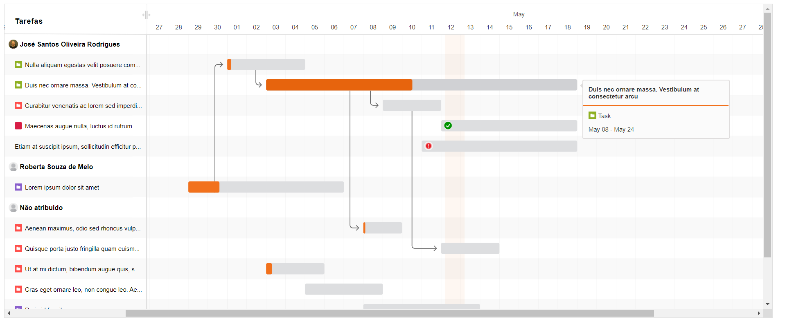
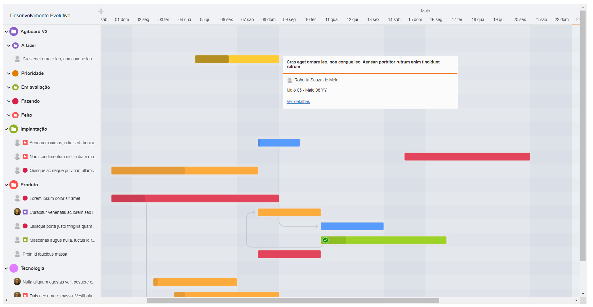

<div align="center">
    <h2 align="center">Frappe Gantt customized</h2>
    <p>A simple, interactive, modern gantt chart library for the web</p>
    
		<br /><br />
		
    <br /><br />
</div>

<div align="center">
    <h4>Frappe Gantt</h4>
    <p align="center"> 
        <a href="https://frappe.github.io/gantt">
            <b>View the demo (frappe version) »</b>
        </a>
    </p>
    <a href="https://frappe.github.io/gantt">
        
    </a>
     <br /><br /><br /><br />
</div>

### Install (my version)

```
npm install github.com/Kahuecosta/gantt
```

### Install (frappe version)

```
npm install frappe-gantt
```

### Usage

Include it in your HTML:

```
<script src="frappe-gantt.min.js"></script>
<link rel="stylesheet" href="frappe-gantt.css">
```

You can also pass various options to the Gantt constructor:

| OPÇÃO                               | DESCRIÇÃO                                                                                      |
| ----------------------------------- | ---------------------------------------------------------------------------------------------- |
| header_height                       | Altura do cabeçalho                                                                            |
| column_width                        | Largura padrão das colunas. Obs: Este valor é sobrescrito internamente                         |
| view_modes                          | Modos de visão do Gantt                                                                        |
| view_mode                           | Modos de visão inicial do Gantt                                                                |
| bar_height                          | Altura da barra de representação da demanda                                                    |
| bar_corner_radius                   | Arredondamento da barra de representação da demanda                                            |
| arrow_curve                         | Curvatura da flecha de dependência                                                             |
| padding                             | Espaçamento padrão em colunas e linhas                                                         |
| padding_start                       | Espaçamento padrão do inicio do Gantt                                                          |
| padding_end                         | Espaçamento padrão no final do Gantt                                                           |
| date_format                         | Formato padrão de Datas                                                                        |
| popup_trigger                       | Tipo de evento que abre o Popup                                                                |
| language                            | Idioma do Gantt. Usado principalmente para tradução de datas                                   |
| margin_bottom                       | Margem inferior do Gantt                                                                       |
| disallow_popup                      | Desabilitar ou habilitar o popup                                                               |
| readonly                            | Desabilitar ou habilitar as ações no Gantt                                                     |
| draggable_bar                       | Desabilitar ou habilitar o drag and drop de PERÍODO nas barras                                 |
| draggable_bar_handles               | Desabilitar ou habilitar o drag and drop de PROGESSO nas barras                                |
| hasArrows                           | Desabilitar ou habilitar as linhas de dependências                                             |
| move_dependent                      | Ao mover a posição de uma demanda também mover a posição de demandas dependêntes               |
| hide_labels                         | Esconder o título da demandas na barra                                                         |
| fixed_label_location                | Fixar exibião do título da demandas ao lado da barra                                           |
| horizontal_auto_scroll_labels       | Desabilitar ou habilitar que o título da demanda na barra se mova ao rolar o scroll horizontal |
| handle_bar_color                    | Cor padrão dos elementos de redimencionar a barra de demanda                                   |
| handle_progress_color               | Cor padrão do elemento de progresso da barra de demanda                                        |
| resource_resize_enable              | Desabilitar ou habilitar a função de redimencionar a árvore de demandas                        |
| resource_fixed                      | Desabilitar ou habilitar tamaho fixo da árvore de demandas                                     |
| resource_enable                     | Desabilitar ou habilitar a árvore de demandas                                                  |
| resource_collapse_enable            | Desabilitar ou habilitar a função de expandir e recolher os grupos da árvore de demandas       |
| resource_title                      | Título padrão da árvore de demandas                                                            |
| resource_width                      | Largura padrão da árvore de demandas                                                           |
| resource_min_width                  | Largura minima da árvore de demandas                                                           |
| responsables_enable                 | Desabilitar ou habilitar a exibição do responsável da tarefa                                   |
| responsables_sort_by                | Ordenação de demandas na árvore por responsável                                                |
| responsables_default_name           | Nome padrão de responsável para a demanda não possui um responsável                            |
| responsables_default_photo          | Foto padrão de responsável para a demanda não possui um responsável                            |
| groups_enable                       | Desabilitar ou habilitar grupos na árvore de demandas                                          |
| groups_sort_by                      | Ordenação de grupos na árvore de demandas                                                      |
| workitems_sort_by                   | Ordenação de tarefas na árvore de demandas                                                     |
| workitems_custom_tooltip            | Habilitar a customização de tooltip                                                            |
| workitems_click_tooltip_open_detail | Habilitar a abertura dos detallhes da demanda ao clicar no tooltip                             |
| new_workitem_enable                 | Habilitar a criação de demanda direto no Gantt                                                 |
| new_workitem_text                   | Placeholder do campo de criar demanda                                                          |
| rows_alternate_background           | Desabilitar ou habilitar linhas zebradas                                                       |
| grid_ticks                          | Desabilitar ou habilitar as linhas de marcação das colunas                                     |
| bar_color_default                   | Cor padrão das barras para quando a cor não é informada no workitem                            |
| link_detail_text                    | Texto do link dentro do popup para a abertura de detalhes de uma demanda                       |
| highlights_weekend                  | Marcar colunas de finais de semana com fundo diferenciado                                      |
| highlights_past_days                | Marcar colunas de dias no passado com fundo diferenciado                                       |
| dir_assets                          | Caminho relativo para assets do componente                                                     |
| zoom_max                            | Quantidade máxima de vezes que o Zoom pode ser efetuado                                        |

| EVENTOS             | DESCRIÇÃO                                                    |
| ------------------- | ------------------------------------------------------------ |
| on_click            | Clique na barra da demanda                                   |
| on_dblclick         | Clique duplo na barra da demanda                             |
| on_date_change      | Alteração do período da demanda via drag and drop na barra   |
| on_progress_change  | Alteração do progresso da demanda via drag and drop na barra |
| on_view_change      | Alteração do modo de visão do Gantt                          |
| on_link_open_detail | Clique no link de abertura dos detalhes da demanda           |

And start hacking:

```js
const responsables = [
    {
        id: 1,
        name: 'Kahuê Costa',
        photo: './images/responsable-1.jpg',
    },
    {
        id: 2,
        name: 'João Silva',
        photo: './images/responsable-default.png',
    },
];

const workitems = [
  {
    id: 'Task 1',
    name: 'Redesign website',
    start: '2016-12-28',
    end: '2016-12-31',
    responsable_id: 1,
    progress: 20,
    dependencies: 'Task 2, Task 3',
    custom_class: 'bar-milestone' // optional
  },
  ...
];

const workItemTypes = [
    {
        id: 'design',
        name: 'Web Design',
        bar_class: 'bar-design',
        color: '#e27d02',
    },
];

const gantt = new Gantt("#gantt", workitems, workItemTypes, responsables);
```

```js
const options = {
	on_click: function (workitem) {},
	on_dblclick: function (workitem) {},
	on_date_change: function (workitem, start, end) {},
	on_progress_change: function (workitem, progress) {},
	on_view_change: function (mode) {},
	on_link_open_detail: function (id) {},
	header_height: 50,
	view_modes: ['Quarter Day', 'Half Day', 'Day', 'Week', 'Month'],
	view_mode: 'Day', // 'Quarter Day' - 'Half Day' - 'Day' - 'Week' - 'Month' - 'Year'
	bar_height: 20,
	bar_corner_radius: 3,
	arrow_curve: 5,
	padding: 18,
	padding_start: null, // view_mode: 'Day' => padding_start in days
	padding_end: null, // view_mode: 'Day' => padding_end in days
	date_format: 'YYYY-MM-DD',
	popup_trigger: 'click',
	custom_popup_html: null,
	language: 'en',
	margin_bottom: 100,
	disallow_popup: false,
	readonly: false,
	draggable_bar_handles: true,
	hasArrows: true,
	move_dependent: 'right', // 'left' - 'right' - 'both'
	fixed_label_location: false,
	hide_labels: false,
	horizontal_auto_scroll_labels: false,
	draggable_bar: true,
	handle_bar_color: '#752f00',
	handle_progress_color: '#752f00',
	resource_resize_enable: true,
	resource_fixed: true,
	resource_enable: true,
	resource_collapse_enable: true,
	resource_title: 'Tasks',
	resource_width: 250,
	resource_min_width: 300,
	responsables_enable: true,
	responsables_sort_by: 'default',
	responsables_default_name: 'Não atribuido',
	responsables_default_photo: './images/responsable-default.png',
	groups_enable: false,
	groups_sort_by: 'name',
	workitems_sort_by: 'name',
	workitems_custom_tooltip: true,
	workitems_click_tooltip_open_detail: true,
	new_workitem_enable: false,
	new_workitem_text: 'Criar tarefa...',
	rows_alternate_background: false,
	grid_ticks: true,
	bar_color_default: '#f3f2f2',
	highlights_weekend: true,
	highlights_past_days: true,
	link_detail_text: 'Ver detalhes',
	dir_assets: '../dist/assets',
	zoom_max: 5,
}

const gantt = new Gantt(
	'#gantt',
	workitems,
	workItemTypes,
	responsables,
	options
)
```

### Contributing

If you want to contribute enhancements or fixes:

1. Clone this repo.
2. `cd` into project directory
3. `yarn`
4. `yarn run dev`
5. Open `index.html` in your browser, make your code changes and test them.

### Publishing

If you have publishing rights (Frappe Team), follow these steps to publish a new version.

Assuming the last commit (or a couple of commits) were enhancements or fixes,

1. Run `yarn build`

   This will generate files in the `dist/` folder. These files need to be committed.

1. Run `yarn publish`
1. Type the new version at the prompt

   Depending on the type of change, you can either bump the patch version or the minor version.
   For e.g.,

   ```
   0.5.0 -> 0.6.0 (minor version bump)
   0.5.0 -> 0.5.1 (patch version bump)
   ```

1. Now, there will be a commit named after the version you just entered. Include the generated files in `dist/` folder as part of this commit by running the command:
   ```
   git add dist
   git commit --amend
   git push origin master
   ```

License: MIT

---

Project maintained by [frappe](https://github.com/frappe)
